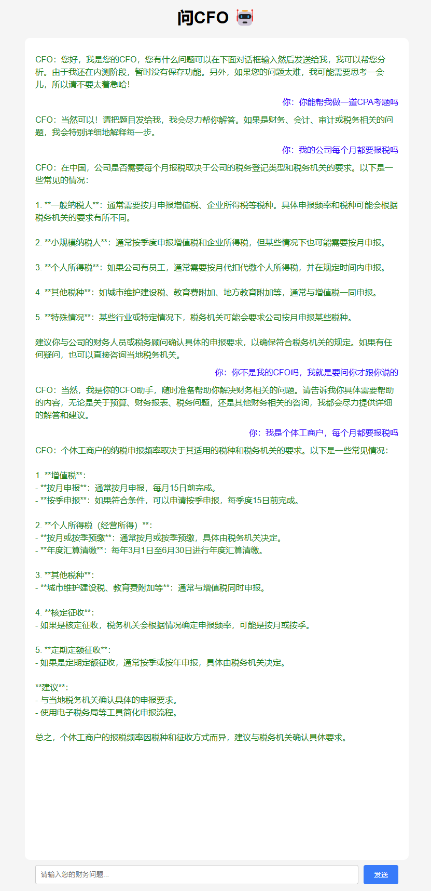

注意：在config文件和backend/main.py中都直接硬编码了api-key

## 本地开发启动流程

### 原内核部分

请在根目录下运行程序，以防止找不到文件

1、启动FastAPI后端：

首先进入wencfo conda env

然后启动：
```bash
uvicorn backend.main:app --host 127.0.0.1 --port 8000
```

2、启动前端页面：
`index.html` => open live server

### Manus模组部分

```bash
### Run OpenManus
python -m open_manus.main

### MCP tool version, run:
python run_mcp.py

### unstable multi-agent version, run:
python run_flow.py
```

## 依赖环境和组件

python=3.12, conda: wencfo in wsl ubuntu22.04

### OpenManus内核

配置文件：config.toml

浏览器内核：playwright install


### DeepSeek API 相关

先安装OpenManus内核，然后安装以下组件：

```bash
pip install fastapi        # FastAPI 框架
pip install "uvicorn[standard]"    # 用于启动 FastAPI 服务器
pip install openai                 # OpenAI API 客户端
pip install slowapi                # 用于速率限制
pip install python-multipart       # FastAPI 上传文件依赖
```

### 自动化Web浏览器的Python库

```bash
pip install playwright
playwright install # 安装所有支持的浏览器，包括Chromium
playwright install --dry-run # 查看浏览器信息
```


## 项目开发进度

### 目标

25年3月23日开始开发第一版，第一版的目标是实现财务工具使用功能、回答财务知识、构建财务知识库等。

在没有财务知识库，仅仅调用API的时候，可以看到CFO的回答能力很差，无法回答专业的财务问题：



### BUG

1、整个流程还是存在含糊的地方，缺乏清晰的链路

2、pdf文件分析的还不错，但是log中的分析结果并没有出现在最终保存的md文件中

更新：找到了正确的分析结果，似乎不是pdf文件分析保存的？保存在了根目录/workspace下面，可能是另一个工具保存的。

3、用browser浏览器浏览网页的时候，如果找不到下载pdf的地方，就会一直找，直到超时

4、还没找到让browser可视化（看到操作过程）的方法

5、前端界面只能做到把内容发送给manus，但是无法持续显示结果。这里可能要把前端和后端的内容都修改一下。